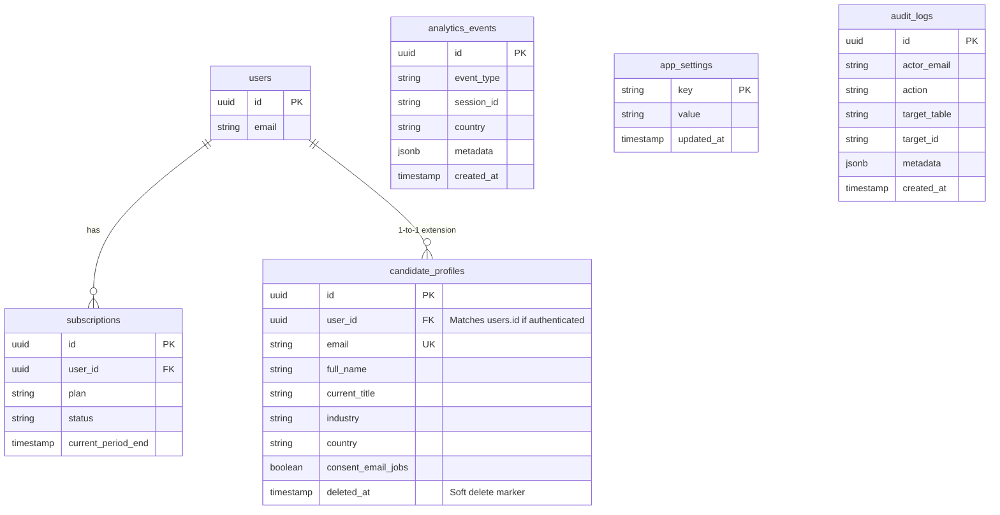

# Entity Relationship Diagram

The following diagram illustrates the core relationships in the Cvyon PostgreSQL (Supabase) database.

## Key Notes
- **`users`**: Managed by Supabase Auth (`auth.users`).
- **`candidate_profiles`**: Contains both authenticated users (where `user_id` matches `auth.users.id`) and guest users (identified solely by `email`).
- **Soft Deletes**: The `candidate_profiles` table implements soft-deletes via the `deleted_at` column to preserve analytical integrity while fulfilling data deletion requests.
